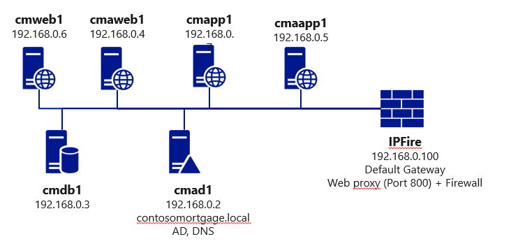

# Challenge 1: Establish your plan

[back](../../README.md)

## Introduction ##
**Contoso Mortgage is a fictious company** with a lot of servers. However the current migration focus is about the following _footprint_:  

  
  
**2 business applications** are run in that setup:  
- One is for the customers and available in the public. 
- The other is for internal personel and requires authentication. They share the same network and use the same database. 
 

By the end of this challenge you should be able to answer the following **questions**:
- Which tool would you use to show the servers dependencies?
- How would you estimate the monthly Azure costs? 
- How can you leverage existing onpremises identities in the Azure Subscription (e.g. Ops groups)?
- How would you make sure that migrated applications need to be segmented at the network layer?
- How will Contoso Mortgage host its public DNS in Azure and manage DNS records for its migrated web applications?  
  
[back](../../README.md)  

