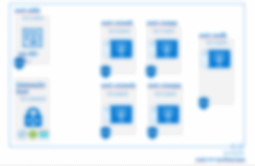

# Challenge 2: Assess workloads for migration

[back](../../README.md)

## Introduction ##
While the first challenge was more theoretical - this challenge is more practial. To successfully master it you should:  
- Do an assessment of the current environment.
- Do a cost estimation
- Design a network topology in Azure

## Success criteria ##
- **Show the dependencies** between servers in the on-premises environment.
- Have a **draw**ing of an **azure network design** that limits communication between application tiers to only the required ports and protocols
- Servers targeted for migration are sized appropriately and the compute needs
- **Present a cost estimation / month in € for North Europe region** based on an equivalent performance to the existing on-premises servers.

> **Tips**:  
>- Start in your Azure Portal by **creating an 'Azure Migrate' project**  (add the Microsoft Tools - and discover your Hyper-V host) 
>- **Import** the Azure Migrate **virtual appliance as vm into your Hyper-V** (Take a look under F:\...Appliance...) - and hook it to the InternalMigrateSwitch
>- **Network Diagram:** e.g. [Download the Microsoft Azure Cloud and AI Symbol / Icon Set](https://www.microsoft.com/en-us/download/details.aspx?id=41937) and start **draw something** using Visio | Powerpoint | etc.  

[back](../../README.md)  

